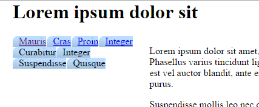
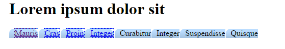
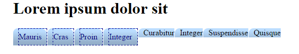

#CSS rules

The first thing we'll do is to style the ordered list that represents our menu:

At the moment our navigation is set to be 20%, if we want our navigation to show as a horizontal set of tabs we need that percentage to change.

Edit your css file so it shows:

~~~

#navigation
{  
  width: 100%;
  float: left;  
}

~~~

In your home.html file add the following id to the `<ol`> element:

~~~

  
  
      <ol id="menu">  
        <li><a href="home.html">Mauris</a></li>  
        <li><a href="page1.html"> Cras </a></li>  
        <li><a href="page2.html">Proin</a></li>  
        <li><a href="page3.html">Integer</a></li>  
        <li>Curabitur</li>  
        <li>Integer</li>  
        <li>Suspendisse</li>  
        <li>Quisque</li>  
      </ol>  
  

~~~

Next add the following rule to the home.css file:

~~~

ol#menu {
    height: 2em;
    list-style: none;
    margin: 0;
    padding: 0;
}

~~~

So, what's happening here? We are setting the height of the menu (which will be our bar of tabs) to 2 em units (which is twice the height of the current font.) In most browsers, this is automatically calculated because all the list items (tabs) will be 2 em units in height.

Then we removed the numbers next to the list by removing its list style.

The margin and padding are both set to 0 to avoid any spacing inside and outside the list. 

Next we'll style the default state for each list item (tab) inside the menu:

~~~
ol#menu li {
    background: url(tabs.gif);
    float: left;
    margin: 0 1px 0 0;
    padding-left: 10px;
}
~~~

In this rule we set margin to be  0 1px 0 0; this means the same as margin-top: 0; margin-right: 1px; margin-bottom: 0; margin-left: 0;. We reset all margins of the tab because some browsers give the `<li`> element a margin by default. The 1 pixel to the right leaves a tiny gap between the tabs. You can adjust this value to your liking.

Last, but not least, we set the left padding to 10 pixels. This is an important value which depends on the tab image. It has to be at least as wide as the left part of the tab. Without the padding, the left part will be covered by the background image of the `<a`> element. 

Here we can see the background image appear for each list item however our list items are not in a row. They are floating left but we want them accross the top of the maincontent. We need to change the size of the navigation div so it is 100% of it's container.

~~~

#navigation
{  
  width: 100%;
  float: left;  
}
<<<<<<< HEAD

~~~

Next we deal with the `<a`> element nested in the `<li`> element.

~~~
ol#menu a 
{
    background: url(tabs.gif) 100% 0;
    border: dashed thin;
}

~~~

For the background, we are using the same image as for the `<li`> element, with added position coordinates. 100% 0 means 100% to the right, no offset vertically. Since the `<a`> element is inside the `<li`> and thus on top of it, this background image will be drawn over the background image of the `<li`> element. So, the only visible part of the `<li`> element will be the 10 pixels of padding that we specified earlier on the left. This 10 pixel part can be seen to the left of the dashed border drawn around the `<a`> element. Together, these background images form a whole tab which can be anywhere from 20 to 490 pixels wide. This forms the two rounded ends of each tab. You can compare to the other four tabs that have no `<a`> elements (Curabitur, Integer, Suspendisse and Quisque) and thus have no rounded right hand corner.

Next we deal with the colour of text, and the size of the `<a`> element by adding the following:

~~~
ol#menu a
{
    background: url(tabs.gif) 100% 0;
    color: #008;
    float: left;
    line-height: 2em;
    padding-right: 10px;
    text-decoration: none;
    border: dashed thin;
}

~~~

We specify a dark blue color for the text inside the tab. Since the text is a link, we have to specify the color specifically for the `<a`> element, because otherwise the default color (usually clear blue) would overwrite it.

The element should have display: block; because it should act as a block element, rather than an inline element (i.e. text.) This means that I can give it padding, margin, width, height and all that. However, since MSIE6 gives the element the wrong width, float: left; is used because it implies display: block; with the addition of making the element shrink to its smallest possible size (taking content and padding into account.) We don't have to worry about the element "floating" since it has no sibling elements.

We give the element a line height because it's essentially the same as height (as long as the text stays on one line), with the difference that it is vertically centered.

The padding to the right should be just as much as it was for the `<li`> element, so that the text will be centered. If you want more spacing to the left and/or right, you modify the left padding in the `<li`> element and the right padding in this one.

