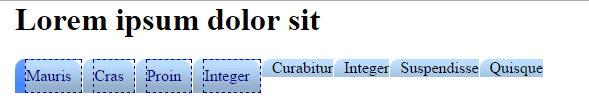
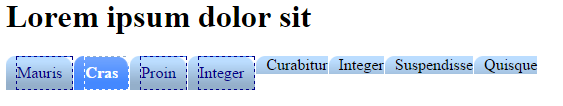
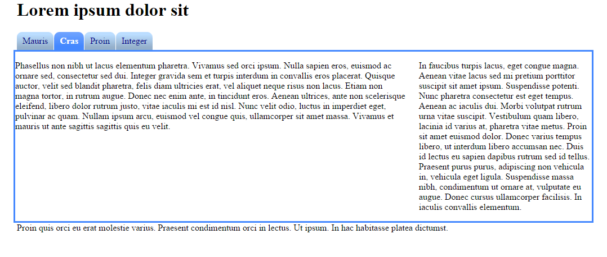

#Selected Tab

Now we want to offset the image when the tab is selected so that the colour changes to the lower row of the image.

To do this we target the list item that is in classified as current. (step 1)

ol#menu li.current 
{
    background-color: #48f;
    background-position: 0 -60px;
}

For the currently selected tab, we change the background color to something that fits the color of the active state of the tab. More importantly, we change the offset, or position, of the background image to move 60 pixels up. This is because one row in the tab image was 60 pixels high, and we want the second row, so we move the image up, revealing its lower part.

Notice that we are not using the background shortcut here. That's because I only want to override some of the properties, and leave the background-image property as it was in the `<li`> rule.

In the image above you can see the new blue colour behind the `<a`> element. Next we must set the image offset for the `<a`> element itself

~~~
ol#menu li.current a 
{
    background-position: 100% -60px;
    color: #fff;
    font-weight: bold;
}
~~~

We have done the same for the the `<a`> element except its the right side so the offset is -60px, we have also change the font to white and bold.

Make sure each page has the correct id and class names for the navigation menu and remove from the list in the navigation div those list items we don't use. You also need to fix the main content so it fills the width of the body so the final version should look like this:

