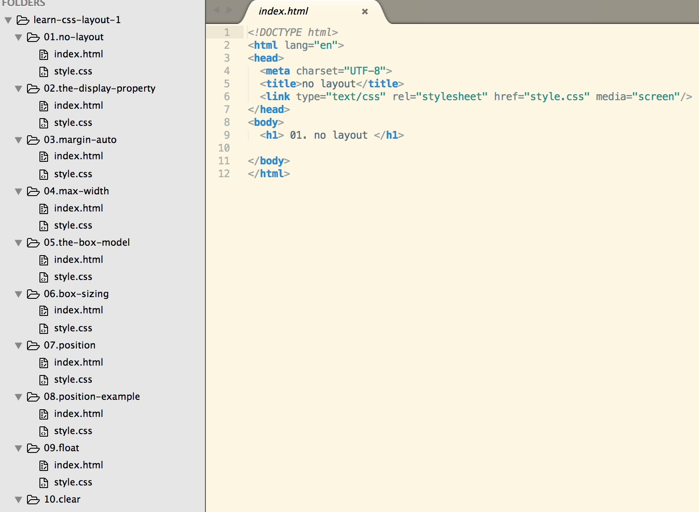

##Lab setup up

For all of the steps in this lab, you will use the following project:

- [learn-css-layout-1-starter.zip](archives/learn-css-layout-1-starter.zip)

Download and unzip this file, and open it in sublime. Remember, dragging/dropping the folder into Sublime should enable you to see something like this:

Each of the folders contains a single html + css file. These are largely empty and will be the focus of the experiments in this lab. You will be adding elements/rules to the html/css files (and examining the results in a browser). Each folder will focus on a different aspect of CSS layout techniques.

#no layout

For the following experiments, work in the `01.no-layout` folder.

Having no layout whatsoever is almost ok if all you want is one big column of content. However, if a user makes the browser window really wide, it gets kind of annoying to read: after each line your eyes have a long distance to travel right-to-left to the next line. 

Paste an example paragraph into the body:

~~~
  

    Vel et enim consulatu. Te civibus copiosae salutandi vel. Adhuc sonet libris ad eam, 
    mundi affert mea ex. Dicunt feugiat patrioque et mel, id qui nusquam maluisset, ei vim 
    justo ceteros vituperata. Mei saepe mediocrem ut. Repudiare definitiones ea ius, sint 
    commodo est ea, nam no nemore diceret.
  

~~~

Open the file in a browser and try various sizes.

Before we fix this problem, let's make sure we're clear on the very important display property.

