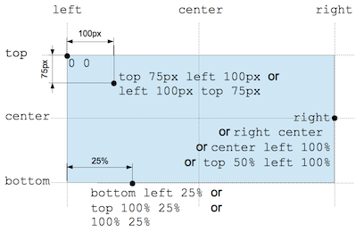

#float

For the following experiments, work in the `09.float` folder.

Another CSS property used for layout is float. Float is intended for wrapping text around images.

Download this image here and store it in the  `09.float` folder:

Now bring in this element:

~~~html
  

    
    the position CSS data type denotes a coordinate in a 2D space used to set a location relative to a box. A specific 
    coordinate can be given by a two keywords, with specific offsets. A keyword represent one edge of the element's box or 
    the medium line between two edges: left, right, top, bottom or center (which represents either the center between the 
    left and right edges, or the center between the top or bottom edges, depending on the context). An offset can be 
    either a relative value, expressed as a percentage, or an absolute length value. Positive values are offset towards 
    the right or towards the bottom, whichever is suitable. Negative values are offset in the other.
  

~~~

Render the above in chrome and observe the results.

Now try this additional rule here:

~~~
img {
  float: right;
  margin: 0 0 1em 1em;
}
~~~

... and notice the changed positioning of the image.
