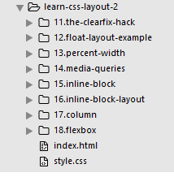
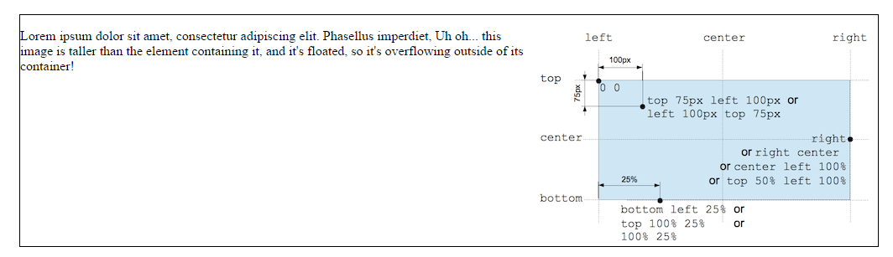

##Lab Setup up

For all of the steps in this lab, you will use the following project:

- [learn-css-layout-2-starter.zip](archives/learn-css-layout-2-starter.zip)

Download and unzip this file, and open it in sublime. Remember, dragging/dropping the folder into Sublime should enable you to see something like this:

Each of the folders contains a single html + css file. These are largely empty and will be the focus of the experiments in this lab. You will be adding elements/rules to the html/css files (and examining the results in a browser). Each folder will focus on a different aspect of CSS layout techniques.

#the clearfix hack

For the following experiments, work in the `11.the-clearfix-hack` folder.

Sometimes when float is used, content can overflow beyond its container.

Open the file in a browser and see how the image is displayed within the `<p`> element. 

To fix this we make the second `<div`> a member of the clearfix class as shown here

~~~

    

      
      Lorem ipsum dolor sit amet, consectetur adipiscing elit. Phasellus imperdiet, Uh oh... this image is taller than the element containing it, and it's floated, so it's overflowing outside of its container!
    

~~~

In the css file add the following to the existing rules:

~~~

.clearfix{
	overflow: auto;
}

~~~

Now save and refresh the browser page. The border now contains the image completely. 

