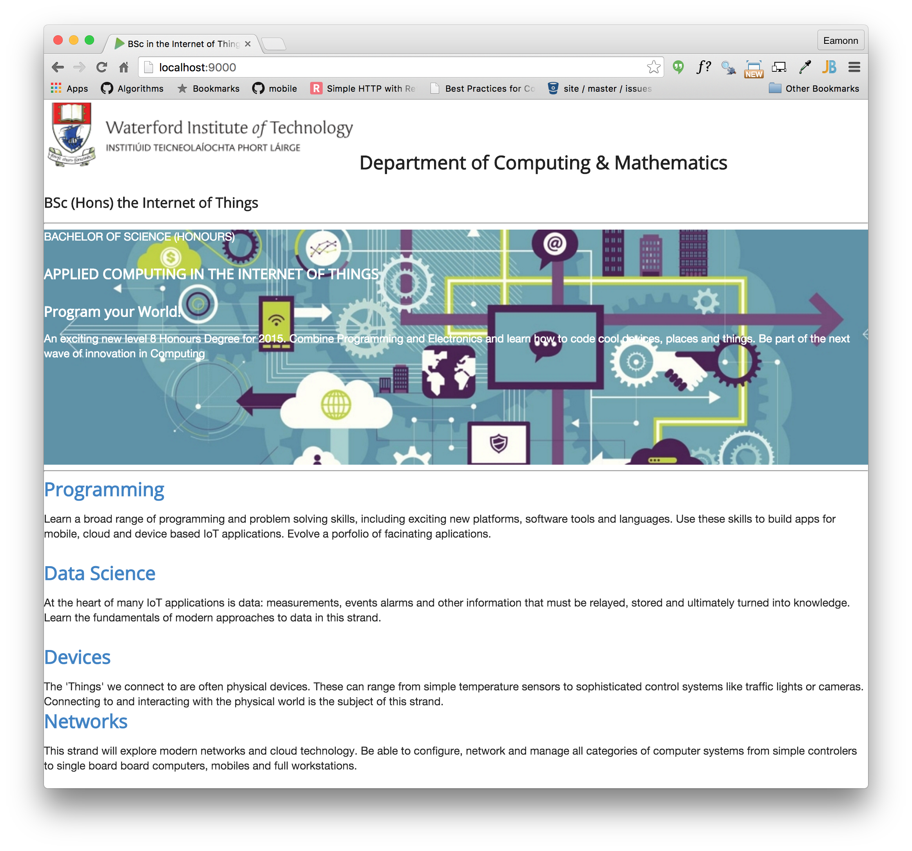

#First Steps...

Open index.ejs and introduce a link to the style sheet we downloaded in the last step:

~~~
  <link rel="stylesheet" href="/assets/css/semantic.css">
~~~

This goes into the `<head>` section of index such that it will look like this:

##index.ejs

~~~
<head>
  <meta charset="UTF-8">
  <link rel="stylesheet" type="text/css" href="http://fonts.googleapis.com/css?family=Open+Sans" />
  <link rel="stylesheet" href="/assets/css/semantic.css">
  <link type="text/css" rel="stylesheet" href="style.css" media="screen"/>
  <title>BSc in the Internet of Things</title>
</head>
~~~

We will also replace the current stylesheet with the following:

##style.css

~~~
.banner {
  background: url("/assets/images/banner.jpg")  top center;
  background-position: top center;
  color: white;
  height:300px;
}
~~~

The page is now back to being unformatted - where we started a few weeks ago - as we have removed almost all of the style sheet rules.

Make sure can see this by browsing the site locally:

- <http://localhost:9000/>

Your page should look like this:

