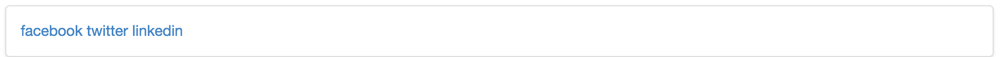
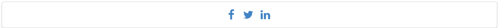

#Archive

This is the version of the site at this stage:

- <https://github.com/wit-computing/iot-web-ejs/releases/tag/V13>

#Exercise 1: Icons

Currently the footer looks like this:

See if you can figure out how to make the section look like this:

As well as the alignment options you have seen so far in this lab, the icons section of the Semantic-UI documentation should help:

- <http://semantic-ui.com/elements/icon.html>

#Exercise 2: Assignment 2

If you have started to move your assignment towards templates, you can also make a start at making use of Semantic UI. Consider introducing the following classes:

- ui container
- ui segment
- ui grid
- ui row
- ui col
- ui center aligned
- ui middle aligned
- ui image
- ui medium image
- ui large image
- ui small image

We have not yet covered navigation in Semantic-UI. However, it is not too difficult to figure it out. Look at this section here:

- <http://semantic-ui.com/collections/menu.html>

Which demonstrates a very simple menu like this:

~~~

  <a class="item">Editorials</a>
  <a class="item">Reviews</a>
  <a class="item active">Upcoming Events</a>

~~~

The above code renders something close to the tab bar you may have been using:

Experiment with the above in your assignment.

