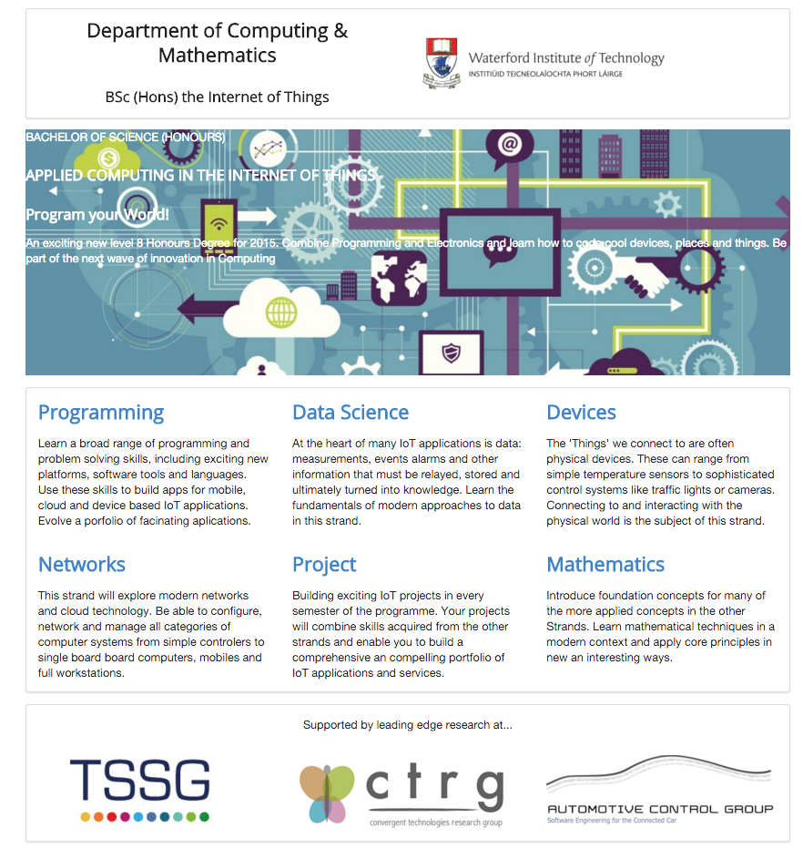

#Setup

This lab assumes you have completed the last lab - an archive of the completed project can be found here:

- <https://github.com/wit-computing/iot-web-ejs/releases/tag/V13>

Make sure you can 'serve' the project using harp. It should look like this:

This lab will enhance the site to look like this:

