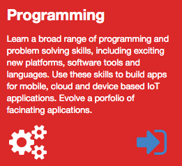
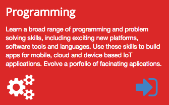
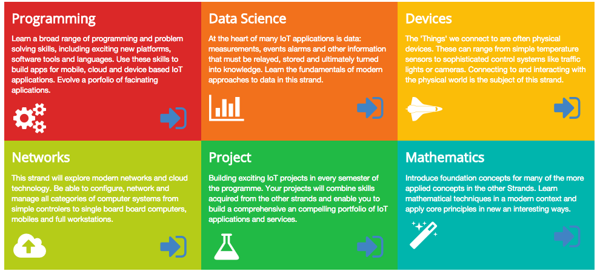

#Icons

We have already seen how to integrate icons into our site in step 2 (twitter, facebook and linkedin). 

We can also enhance other aspects of the site using icons - perhaps as a visual cue or aid, or also a a prompt for navigability:

There is a rich set of icons here:

- <http://semantic-ui.com/elements/icon.html>

We are going to use this one for navigation:
          
- <i class="huge sign in icon"></i>

and these ones for each of the strands:

- <i class="huge settings icon"></i>
- <i class="huge bar chart icon"></i>
- <i class="huge space shuttle icon"></i>
- <i class="huge cloud upload icon"></i>
- <i class="huge lab icon"></i>
- <i class="huge wizard icon"></i>

This is how they are included:

~~~
<i class="huge settings icon"></i>
<i class="huge bar chart icon"></i>
<i class="huge space shuttle icon"></i>
<i class="huge cloud upload icon"></i>
<i class="huge lab icon"></i>
<i class="huge wizard icon"></i>
~~~

In _curriculum.ejs, experiment with the programming strand box:

~~~
...
    <article class="red column">
      <h2> Programming </h2>
      

        Learn a broad range of programming and problem solving skills, including exciting new platforms, software tools and languages. Use these skills to build apps for mobile, cloud and device based IoT applications. Evolve a porfolio of facinating aplications.
      

      <i class="huge settings icon"></i>
      <a href="strands/programming.html">
        <i class="huge sign in icon"></i>
      </a>
      

    </article>
...
~~~

Try this now, the icons should appear on the programming strand + the 'sign in' icon should be a link to the programming strand page.

We might like to have the icons better spaced - in two columns perhaps. This can easily be done sing the grid mechanism we used for the header. Here is an alternative version:

~~~
...
  <article class="red column">
    <h2> Programming </h2>
    

      Learn a broad range of programming and problem solving skills, including exciting new platforms, software tools and languages. Use these skills to build apps for mobile, cloud and device based IoT applications. Evolve a porfolio of facinating aplications.
    

    

      

        <i class="huge settings icon"></i>
      

      

        <a href="strands/programming.html" class="strandlink">
          <i class="huge sign in icon"></i>
        </a>
      

    

  </article>
...
~~~

Note how the icons are now embedded in a 2 column grid - and the individual icons are left and right aligned.

We can incorporate icons in a grid like this for all strands:

~~~
<section class="ui three column grid segment">

  <article class="red column">
    <h2> Programming </h2>
    

      Learn a broad range of programming and problem solving skills, including exciting new platforms, software tools and languages. Use these skills to build apps for mobile, cloud and device based IoT applications. Evolve a porfolio of facinating aplications.
    

    

      

        <i class="huge settings icon"></i>
      

      

        <a href="strands/programming.html">
          <i class="huge sign in icon"></i>
        </a>
      

    

  </article>

  <article class="orange column">
    <h2> Data Science </h2>
    

      At the heart of many IoT applications is data: measurements, events alarms and other information that must be relayed, stored and ultimately turned into knowledge. Learn the fundamentals of modern approaches to data in this strand.
    

    

      

        <i class="huge bar chart icon"></i>
      

      

        <a href="strands/data.html">
          <i class="huge sign in icon"></i>
        </a>
      

    

  </article>

  <article class="yellow column">
    <h2> Devices </h2>
    

      The 'Things' we connect to are often physical devices. These can range from simple temperature sensors to sophisticated control systems like traffic lights or cameras. Connecting to and interacting with the physical world is the subject of this strand.
    

    

      

        <i class="huge space shuttle icon"></i>
      

      

        <a href="strands/devices.html">
          <i class="huge sign in icon"></i>
        </a>
      

    

  </article>

  <article class="olive column">
    <h2> Networks </h2>
    

      This strand will explore modern networks and cloud technology. Be able to configure, network and manage all categories of computer systems from simple controlers to single board board computers, mobiles and full workstations.
    

    

      

        <i class="huge cloud upload icon"></i>
      

      

        <a href="strands/networks.html">
          <i class="huge sign in icon"></i>
        </a>
      

    

  </article>

  <article class="green column">
    <h2> Project </h2>
    

      Building exciting IoT projects in every semester of the programme. Your projects will combine skills acquired from the other strands and enable you to build a comprehensive an compelling portfolio of IoT applications and services.
    

    

      

        <i class="huge lab icon"></i>
      

      

        <a href="strands/maths.html">
          <i class="huge sign in icon"></i>
        </a>
      

    

  </article>

  <article class="teal column">
    <h2> Mathematics </h2>
    

      Introduce foundation concepts for many of the more applied concepts in the other Strands. Learn mathematical techniques in a modern context and apply core principles in new an interesting ways.
    

    

      

        <i class="huge wizard icon"></i>
      

      

        <a href="strands/programming.html">
          <i class="huge sign in icon"></i>
        </a>
      

    

  </article>
  
</section>
~~~

