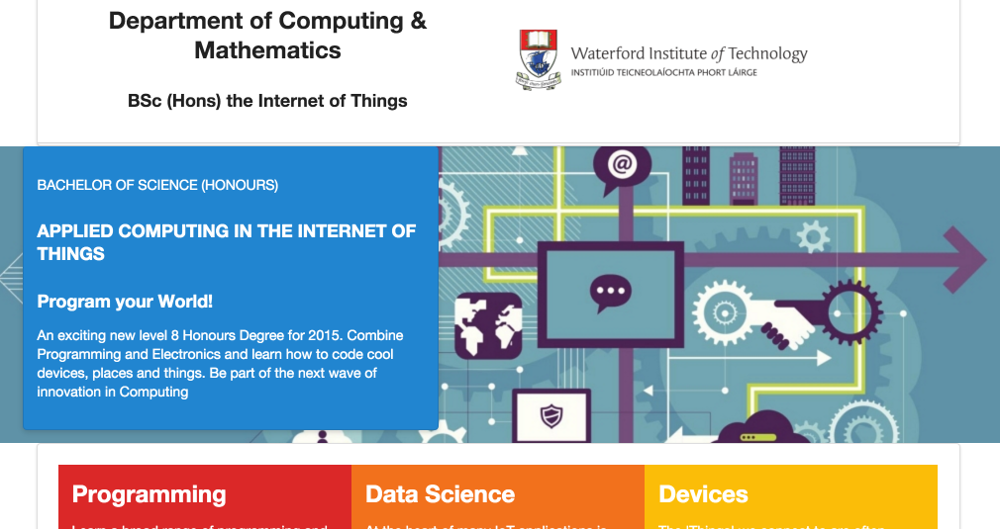

#Banner

Currently the banner/summary section needs some attention:

The text is not really legible - and is too wide to read. This is what we would like to have:

Notice how the images is stretched to the edges.

The first step will be to rework the index.ejs page to have the image adjusted to the full width of the page:

~~~
<body>
  <section class="ui container">
    <%- partial("includes/_header.ejs") %>
  </section>
  <section class="banner">
    <section class="ui container">
      <%- partial("includes/_summary.ejs") %>
    </section>
  </section>
  <section class="ui container">
    <%- partial("includes/_curriculum.ejs") %>
    <%- partial("includes/_sponsors.ejs") %>
    <%- partial("includes/_footer.ejs") %>
  </section>
</body>
~~~

In the above adjustments, we have excluded the `banner` section from the container class - which achieves the desired effect. Try it out now...

We still haven't Here is a replacement for the `_summary.ejs` contents:

~~~
<section class="ui grid">
  <article class="ui seven wide column raised blue segment">
    

      

        BACHELOR OF SCIENCE (HONOURS)
      

      <h3>
        APPLIED COMPUTING IN THE INTERNET OF THINGS
      </h3>

      <h3>
        Program your World!
      </h3>
      

        An exciting new level 8 Honours Degree for 2015. Combine Programming and Electronics and learn how to code cool devices, places and things. Be part of the next wave of innovation in Computing
      

    

  </article>
</section>
~~~

We have wrapped the `<article>` in a grid section, and set the article to be `seven wide`. Remember, the grid has a notional 16 columns, so this width is less than half of the screen. The page should look like this now:

