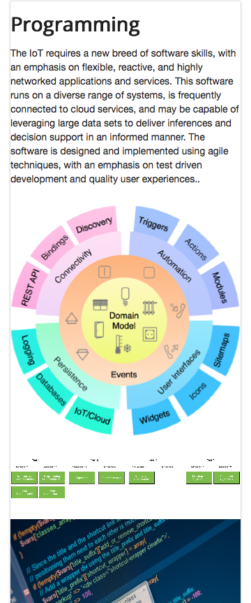

#Layout

The _layout.ejs file in strands offer us another major opportunity to improve a large part of the site by just editing a single file. First, browse the strand pages using a small width browser - the pages will look like this:

If we make one small change in _layout.ejs - making the main section `stackable`:

~~~
<body>
  <section class="ui container">
    <%- partial("../includes/_header.ejs") %>
    <section class="ui stackable grid segment">
      <%- yield %>
    </section>
    <%- partial("../includes/_footer.ejs") %>
  <section>
</body>
~~~

... then all the strand pages are transformed:

This demonstrates a major benefit of using shared layouts - incremental improvements in the layout are immediately available on all dependent pages.

